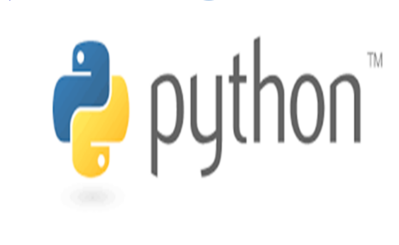

# Welcome to COMPO 1010: Programming for All 1

This course is designed for non-CS major students who desire a practical course for gaining basic computer programming skills.
The course provides a comprehensive study of how to approach programming problems and devise solutions using python programming language.

# Lecture Slides
   +  [Syllabus] (Slides/0.CourseSyllabus.pdf)
   +  [Introduction] (Slides/1.Introduction.pdf)